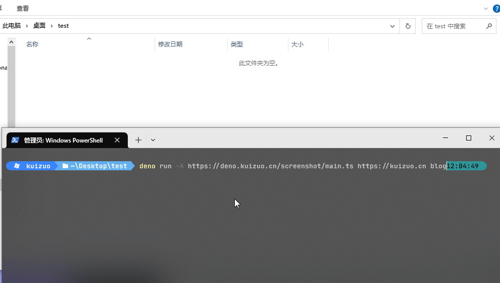

# Deno_screenshot

使用 Deno 截取任意 URL 网页的首页截图

## 前言

每当完成一个项目后，想要截取项目的首页图时，通常需要打开浏览器，输入项目地址，按下 <kbd>PrintScreen</kbd> 按钮进行截屏。往往还需要后期编辑工具调整适合的图像尺寸并压缩图像大小。

这个过程可能非常繁琐，费时费力。因此，本仓库诞生了。

灵感来源： [screenshot](https://github.com/denoland/fresh/blob/main/www/utils/screenshot.ts)

## 用法

确保您已经安装了 [Deno](https://deno.land/) 运行时环境。

```shell
deno run -A https://deno.kuizuo.cn/screenshot/main.ts <url> <name>
```

示例

```shell
deno run -A https://deno.kuizuo.cn/screenshot/main.ts https://kuizuo.cn blog
```

此时会在当前目录下生成一个 `screenshots/blog.png` 文件，里面存放是是 https://kuizuo.cn 的截图。

### 清除 deno 缓存

```shell
deno cache --reload https://deno.kuizuo.cn/screenshot/main.ts
```

## 演示

